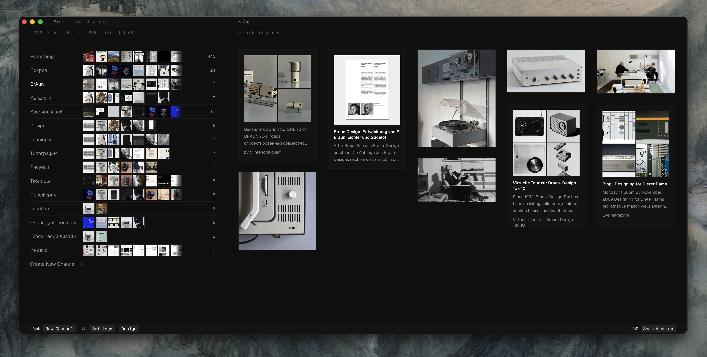

# Mine

> A local-first alternative to Are.na for visual bookmarking. Your collections live as plain files on disk — Markdown + media — not in someone else's cloud.



**Mine** is a macOS desktop app for visually collecting and organizing what you find on the web: images, articles, links, videos. Everything is stored as flat Markdown files with frontmatter in a folder you choose. Collections are Obsidian-compatible pages, and membership is plain wikilinks. No cloud, no Electron, no lock-in.

## Why

- **You own your data.** Every block is a Markdown file plus an optional media file on your disk. Open it in Obsidian, grep it, back it up, sync it through iCloud — it is just files.
- **Built for scale.** A custom virtualized masonry grid stays smooth at 10,000+ blocks.
- **Capture anywhere.** A Chrome/Safari web clipper saves pages, articles, tweets, and YouTube transcripts straight into your vault.

## Features

- Visual masonry grid with five adaptive card types: image, link, article, video, social
- Channels (collections) as Obsidian pages — counts, colors, drag-to-sort
- Web clipper (Chrome + Safari) with article extraction (Defuddle) over native messaging
- Full-text search across the vault (SQLite FTS5)
- One-click import from Are.na
- Two-phase thumbnails: instant native placeholder, async high-quality upgrade
- Obsidian-compatible storage: `.md` files and `![[wikilink]]` media, no proprietary IDs
- iOS companion app (SwiftUI + a shared Rust core via UniFFI) — early

## Stack

Tauri v2 · Rust · SQLite (rusqlite + FTS5) · React 19 · TypeScript · TailwindCSS v4 · shadcn/ui

## Build

```bash
bun install
cargo tauri dev      # development build with HMR
cargo tauri build    # production .app / .dmg
bun run build:extension  # required extension bundle → extension/dist
```

`extension/dist/` is generated and ignored by Git. The desktop build does not
build the browser extension; run `bun run build:extension` before loading the
unpacked `extension/` directory in Chrome or Dia.

Requires Rust (stable), Bun ≥ 1.2, and the Tauri CLI (`cargo install tauri-cli`).

## Status

Active development (v0.1.0). The macOS desktop app is the primary target; the iOS app is early.

## License

[MIT](LICENSE) © 2026 Sergey Seleznev
